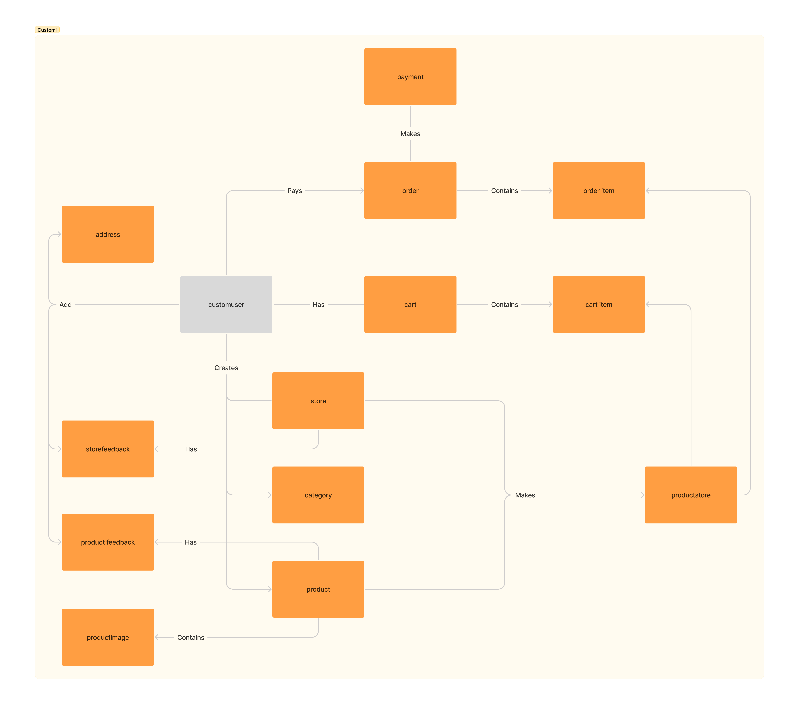

# Customi
The project involves developing a comprehensive online shopping website using Django. The system includes features for customers to browse and purchase products, sellers to manage stores and products, and administrators to oversee operations. Key components encompass user authentication, product management, order processing, payments, and more.
## System Features
### Public Features
- Browse products, categories, and stores
- Search for products and stores by name
- View product details including name, images, description, price, discount, rating, and reviews
- Pagination and sorting options (e.g., best selling, highest rated, newest, highest/lowest price)

### User Features (Authenticated)
- OTP-based registration and verification via phone
- JWT authentication for secure login/logout
- Manage profile and addresses (add, update, delete)
- Add/remove products to/from cart
- Checkout process with address selection and order confirmation
- View order history and track status (Pending, Paid, Shipped, Delivered, Cancelled)
- Submit product reviews and ratings (once per product after purchase)

### Seller Features
- Register as a seller and create/manage store profile
- Add, edit (price, discount, description, stock), and delete products
- View and manage store-specific orders and items
